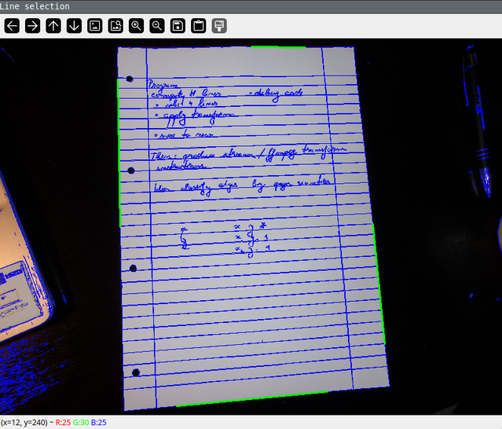
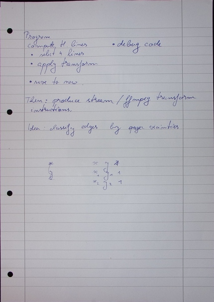

### Crop document from image

This little program allows you to select the edges of a document in an image,
and produces the nicely cropped document.

### Basic build instructions

```
mkdir build
cd build
cmake ..
cmake --build .
```

### Basic usage

```
crop_document <Image_Path> [<Output Path>] 
```

Note that the `config.json` file has to be in the working directory.
This file has the following parameters:
- **`max_width`** (int): Maximum display width of the output image in pixels.
- **`paper_width`** (int): Width of the resulting image in pixels.
- **`paper_height`** (int): Height of the resulting image in pixels.
- **`segment_range`** (double): Minimum pixel range for line segment selection.

Example:
```
crop_document example.jpg out.jpg
```
will display the input image with line segments highlighted in blue. The user is prompted
to select the top, bottom, left and right edges by clicking close to them. The selected edges are
highlighted in green:


Once the user presses 'a' to accept, the out.jpg file is created, looking like this:



